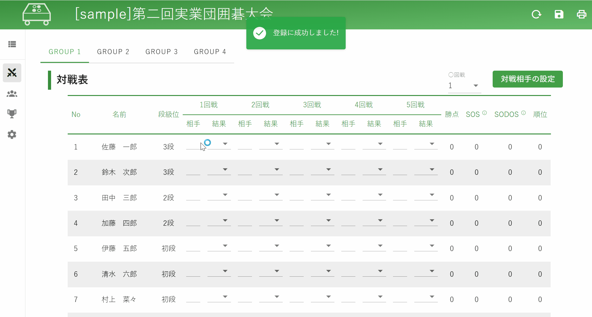
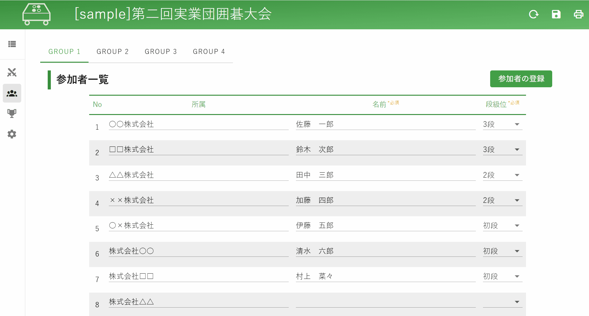
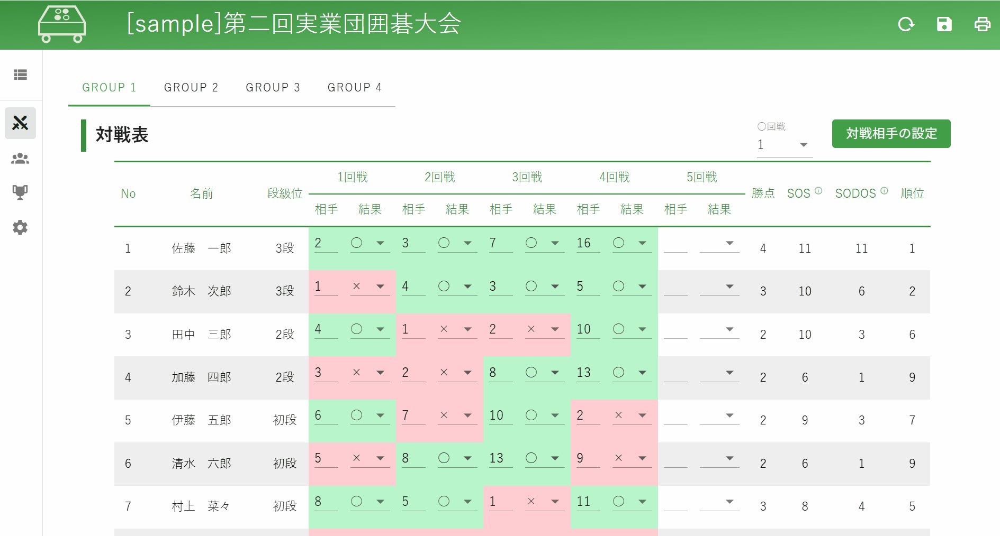
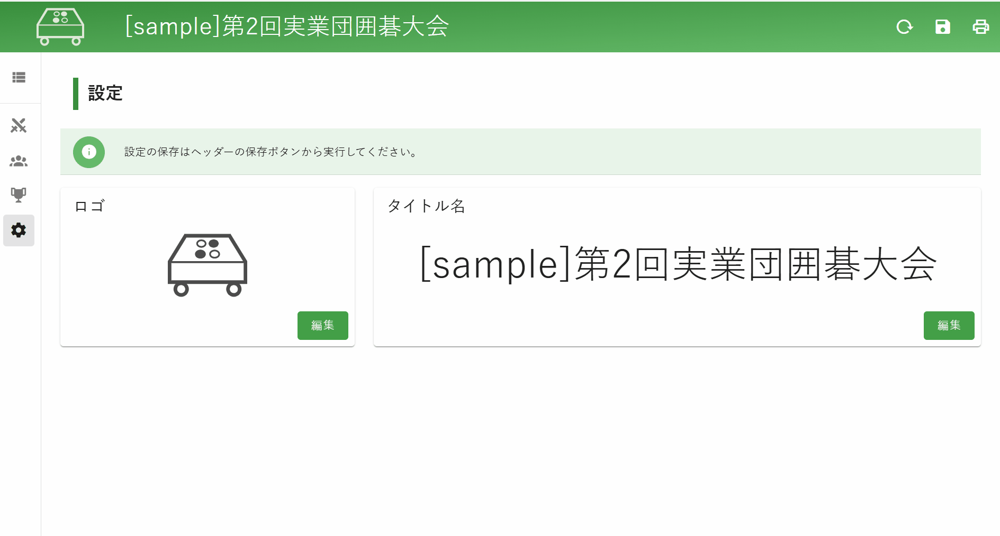

# Feature Overview

`swiss-stage-project`は、主に囲碁・将棋を対象とした、スイス方式トーナメントの対戦組合せ作成アプリです。

最大32名 × 4グループによるトーナメントまで対応できます。

## 画面

### 対戦表



### 参加者一覧



### ランキング



### 設定



## 使い方

### １．参加者リストから、大会の参加者を記載する

- 記載項目は下記
  - 所属
  - 名前　　※必須
  - 段級位　※必須
- 記載後、`参加者の登録`を押下することで、対戦表に大会の参加者の内容が表示されます
- `参加者の登録`押下時、対戦表への反映に加えて、以下2つの処理が実施されます
  - 段級位の高さ順に並び替えを行います
  - 参加人数が奇数の場合、`ダミーユーザー`が追加されます

### ２．対戦表から、対戦相手の設定および、対戦結果の登録をする

- 相手に対戦相手のNoを入力する形で対戦相手の指定を行います
- 対戦結果は結果のセレクトボックスを選択してください
  - 結果は以下の3種類です
    - ○
    - ×
    - △
- `対戦相手の設定`を押下することで、1回戦～5回戦の対戦相手を自動で設定することができます
  - 何回戦に対して、対戦相手を設定するかは、`対戦相手の設定`のセレクトボックスから選択できます
  - お互いの勝ち点の差が0.5点以内かつ一度も対戦していない相手とマッチします
    - 対戦相手のマッチに成功した場合、`対戦相手を設定しました!`のメッセージを表示する
    - 対戦相手のマッチに失敗した場合、`対戦相手の自動設定に失敗しました。手動で設定してください。`のメッセージを表示する

### ３．ランキングから、現在の順位を確認する

- ランキングから、現在の順位を確認することができます

### ４．設定

- 設定から、ヘッダーのロゴとタイトル名の編集ができます

### ５．ヘッダー

- 画面右上の`Excel出力`から対戦表の内容をExcelに出力することができます

- 画面右上の`リセット`から画面の表示内容をすべて初期化することができます

- 画面右上の`保存`から画面の表示内容をすべて保存することができます

- 画面右上の`印刷`から印刷ができます
  - 対戦結果、参加メンバー、ランキングを紙に出力することや、PDF形式で電子データとして保存できます

## 順位の組み方

1. 勝敗が多いものを上位とする
2. 勝敗が同じ場合は、すべての対戦相手の勝敗の合計（SOS）が多いものを上位とする
3. それでも同じ場合は、自分より勝った相手の勝敗の合計（SODOS）が多いものを上位とする

```txt
SOS:  Sum of Opponents Scores（対戦相手の勝ち星の数）
SODOS:Sum of Defeated Opponents Scores（負かした対戦相手の勝ち星の数）
```
